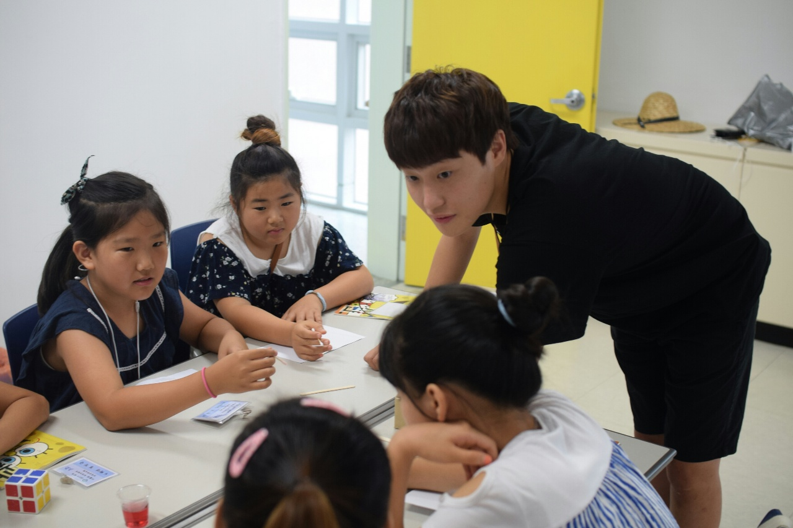
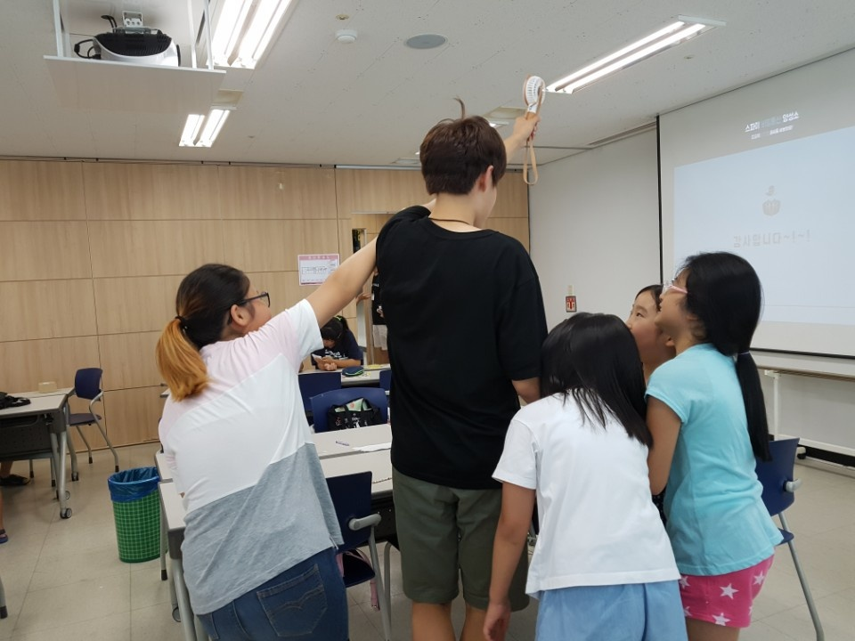
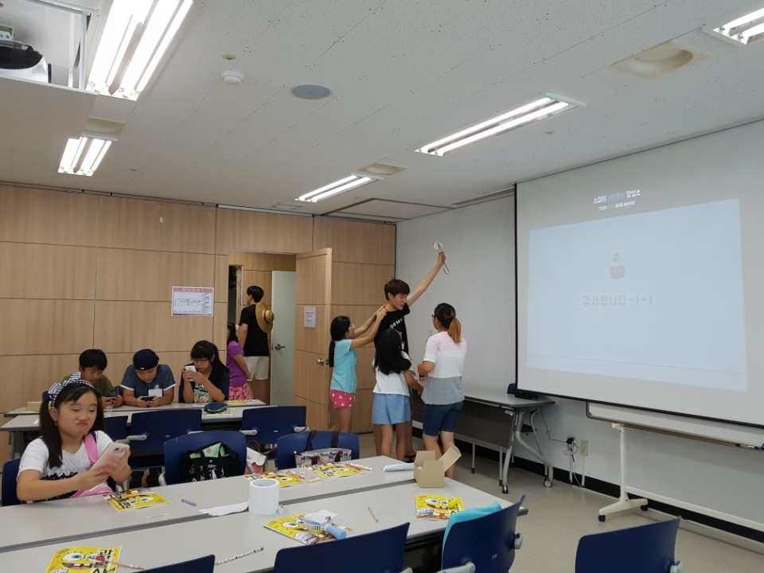
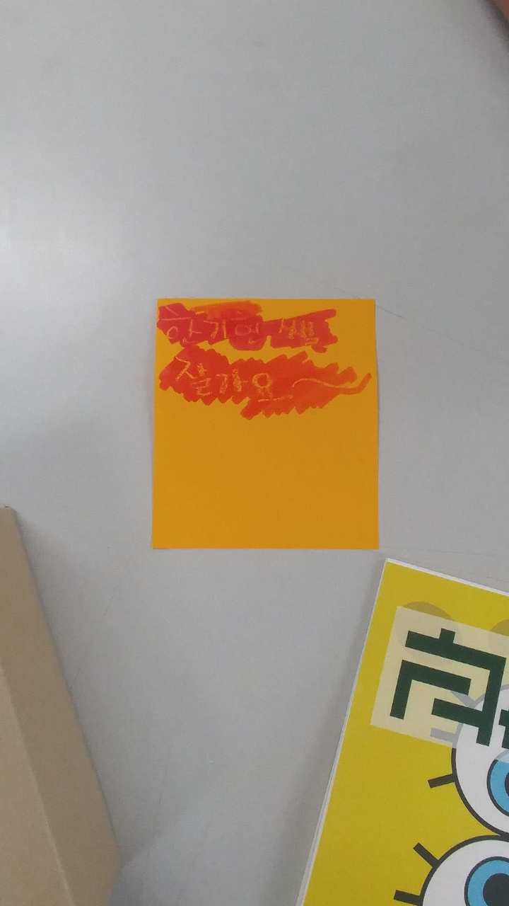
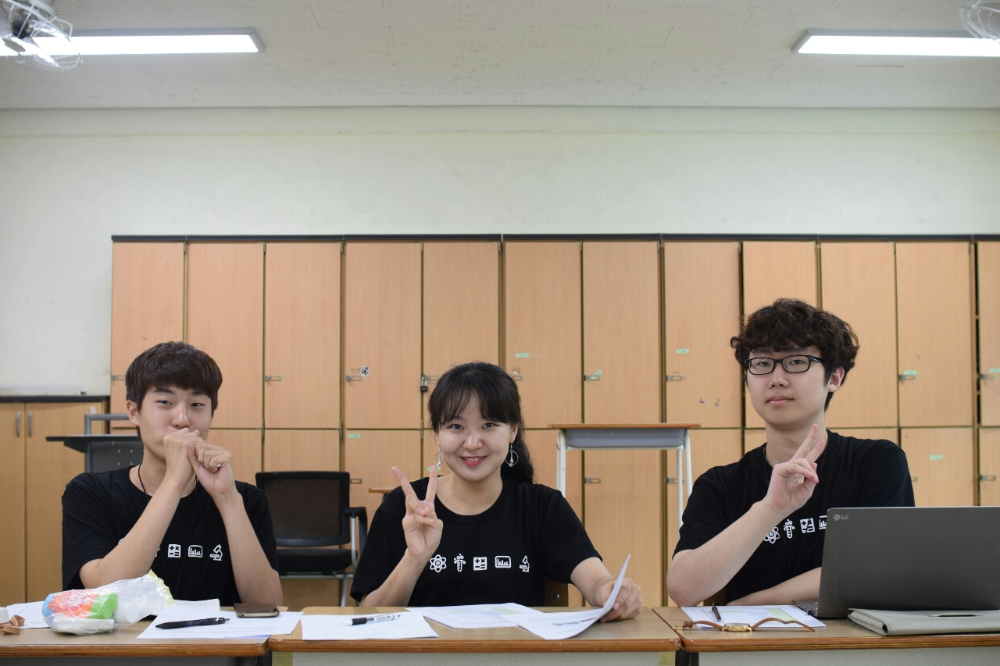
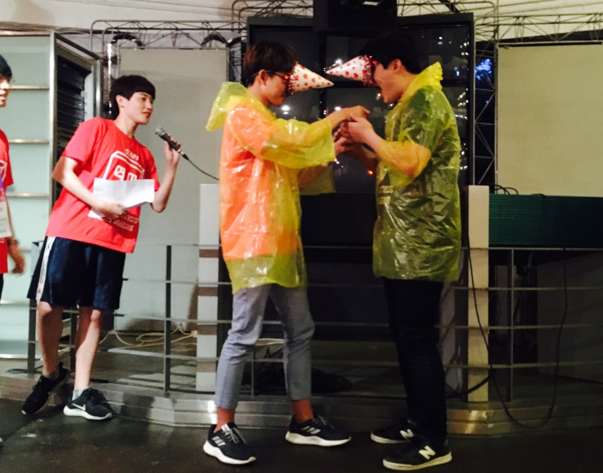
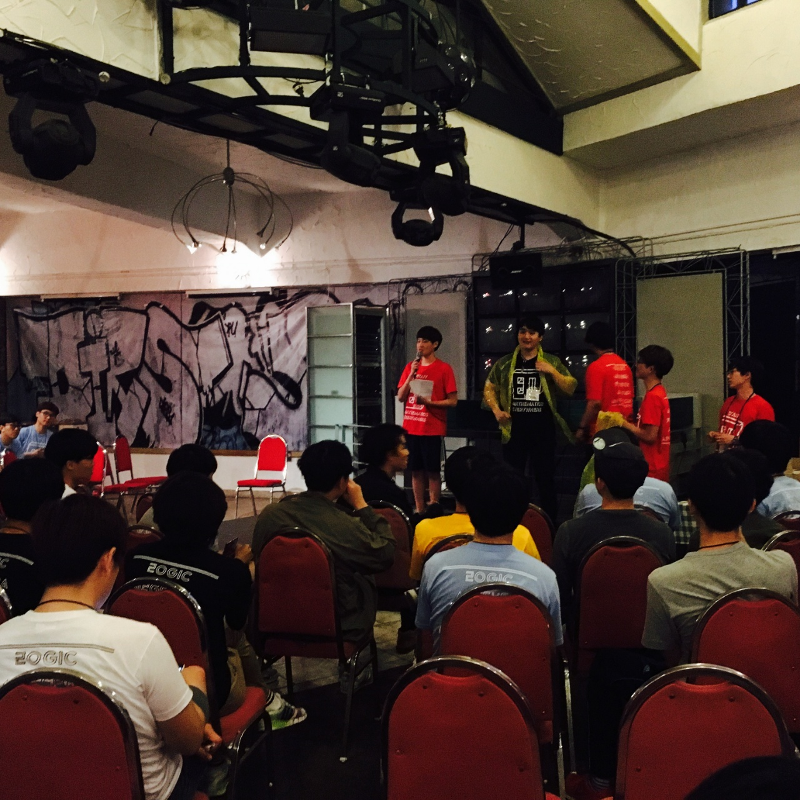

## College of Natural Sciences Summer Science Volunteering Camp in 2017
I instructed elementary students on writing a secret letter with a liquid which changes its color by temperature.

Kids liked my portable fan so much and called me Mr. FAN :)

One of the kids said goodbye to me in a secret letter.

Also, I was an interviewer in a mock interview for high school students' university admission.

## Student President of the Department of the Mathematical Sciences
I was elected as the student president of the department and worked for a year (Oct 2017 - Oct 2018).
Due to many duties in December 2017, I got low grades in the Fall semester, but I feel proud of what I have achieved.

My promises were as follows, and fortunately, all of them came real.

| Promises                      | Result                        |
|:------------------------------|:------------------------------|
| Improve convenience of Department library | Installed electric outlets and air purifiers in the library |
| Systemize department club activities | Developed the register form and added 2 clubs in my term |
| Establish freshmen manual | Published the manual to freshmen including transportation and restaurants |
| Develop a file-sharing hub to prepare for department events | Made a Google Drive to upload/download files easily |

I organized and emceed many department events. (In fact, this picture was taken in May 2017, which was earlier than when I was elected)

[back](./)
