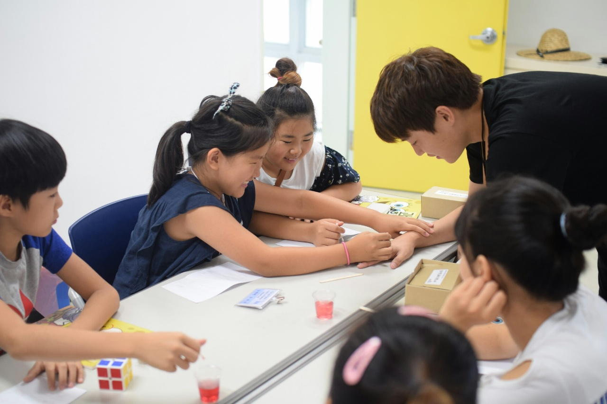

# Welcome to my Homepage 
* * *

I am an undergraduate of Seoul National University majoring in Mathematical Sciences from 2016.
My double-major is **Statistics**, the subject I want to study as a researcher.

I live in Bucheon, South Korea. My Korean name is **한기현** (This might help you find my name on the awards list and the homework).

I work as a part-time math instructor at P&K Math Academy (profile picture on the left), and I am a former student president of the Department of Mathematical Sciences.

The homepage consists of
*   Education
*   Honors, Awards, and Scholarships
*   Research
*   Selected Assignments and Reports
*   Extracurricular Activities

* * *
## Education
* * *
**Seoul National University**

Bachelor of Science in Mathematical Sciences and Statistics
*   Expected Graduation Date: Jul 2022

**Seoul Science High School**
*   Graduation Date: Feb 2016

### Academic Gap (2019 - 2020)

I served in the Republic of Korea Army (Apr 2019 - Nov 2020).

During the military service, I was aware that I have to take other courses in Spring 2021 required for graduation, such as the “Earth and Environmental Sciences Lab.” course. Thus, I tried to gain background knowledge of graduate study and studied several statistics books and materials.

#### Previewed

*   Ch1 - Ch5 (Markov Chains) of **“Probability: Theory and Examples”** _by R. Durrett_
    *    Probability Theory 1 _(Grad)_, Probability Theory 2 _(Grad)_ 
*   **“Mathematical Statistics: Basic Ideas and Selected Topics”** _by P.J. Bickel and K.A. Doksum_
    *   Theory of Statistics 1 _(Grad)_
*   Real analysis of **“Real and Complex Analysis”** _by W. Rudin_
    *   Real Analysis _(Grad)_
*   Seoul National University **“Time series analysis”** lecture notes _by S. Cho_
    *   Time Series Analysis and Lab.
*   **“Introduction to Linear Regression Analysis”** _by D. Montgomery, E. A. Peck, and G. Vining_
    *   Regression Analysis and Lab.

#### Reviewed

*   **“Mathematical Statistics”** _by W. Kim_
    *   Mathematical Statistics 1, Mathematical Statistics 2
*   **“Principles of Mathematical Analysis”** _by W. Rudin_
    *   Introduction to Mathematical Analysis 1, Introduction to Mathematical Analysis 2

### Coursera courses
1. __“Deep Learning”__ Specialization (In progress, 4/5)	_offered by “Deeplearning.ai”_ [Certificate](./Coursera_Neural.pdf) / 
[Link](https://www.coursera.org/specializations/deep-learning)
*   Learned the structure of neural networks 
*   Understood contemporary methods of comparing and improving neural network models

2. __“Practical Time Series Analysis”__ course _offered by “The State University of New York”_
[Certificate](./Coursera_PTSA.pdf) /
[Link](https://www.coursera.org/learn/practical-time-series-analysis)
*   Understood theories of traditional time series models (ARMA, ARIMA, SARIMA)
*   Analyzed time series data in economics and environmental sciences with R

3. __“Machine Learning”__ course (Audit) _offered by “Stanford University”_ [Link](https://www.coursera.org/learn/machine-learning)
*  Studied the theories of supervised and unsupervised learning, basic neural network structures, and techniques dealing with overfitting

4. __“Improve Your English Communication Skills”__ Specialization (Audit) _offered by “Georgia Institute of Technology”_ [Link](https://www.coursera.org/specializations/improve-english)
*   Learned how to write professional emails in English
*   Practiced pronunciation and intonation in speaking English

* * *
## Honors, Awards, and Scholarships
* * *
### Honors
*   5 semesters **Dean’s List** in College of Natural Sciences, 2016-1,2, 2018-1,2, 2021-1.

### Awards
*   **Silver Award (3rd place)** in Korea University Students Industrial Engineering Project Competition, 2021. [Link](http://kiie.org/board/board.asp?b_code=5536&Action=content&GotoPage=1&B_CATE=BBS1)
*   **Gold Award** in University Students Contest of Mathematics (for math major), 2018.
*   Bronze Award in University Students Contest of Mathematics (for math major), 2016.
*   Bronze Award (4th place) in Asian Pacific Mathematical Olympiad in 2013.
*   **2 Gold Awards** in Korean Mathematical Olympiad (for high school students), 2012, 2013.

### Scholarships
*   Presidential Science Scholarship, 2016 – Present.
*   Youth Scholarship, Woongjin Foundation, 2013 – 2015. 

* * *
## Research
* * *
### Research 1 (Delivery, Jun 2021 - Nov 2021) 
*   Title: “Dynamic Pickup and Delivery Problem: Dynamic Bundling, Postponement Heuristics, Spatial Clustering based Bundling, and Assignment Heuristics” _with H. Park_

[Abstract](./1.md) / [Full_presentation(Eng)](./Research/Dynamic_Pickup_and_Delivery_Problem(Eng).pdf) / [Full_presentation(Kor)](./Research/Dynamic_Pickup_and_Delivery_Problem(Kor).pdf)	

### Research 2 (Feller Processes, Jun 2021 - Aug 2021)
*   Title: “Feller Processes and Their Applications”

[Abstract](./2.md) / 
[Full_report(Eng)](./Research/Feller.pdf)

### Research 3 (Unit Root Tests for Panel Data, Dec 2020 - Feb 2021)
*   Title: “Unit root tests for Panel Data and Application to World Temperature Data”

[Abstract](./3.md) / 
[Full_report(Eng)](./Research/Panel(Eng).pdf)

### Research 4 (Extreme Value Theory, Sep 2018 - Feb 2019)
*   Title: “Understanding Extreme Value Theory and Application to Fine Dust Level in South Korea”

[Abstract](./4.md) / 
[Full_report(Eng)](./Research/EVT(Eng).pdf)

* * *
## Selected Assignments and Reports
* * *
_Note: For the collection of **homework**, later chapter comes first, so you may find **advanced contents at the upper part**._

### 2021-2 (Fall 2021)
#### "Data Mining and Lab." (2021-2, Prof. Taesung Park)
**Report:** We developed models **predicting the side-effects of the COVID-19 vaccines** on the potential occurrence of life-threatening illnesses. We used logistic regression, linear discriminant analysis, and KNN methods to obtain the models. The research is still in progress, so only the interim report can be offered.

[Data Mining Interim report(Eng)](./DataMining/interim_report.pdf)

The collection of homework includes 
*   comparing accuracies of classifiers made by ridge regression, LASSO, PCR, PLS models with **cross-validation**;
*   fitting logistic regression and comparing the sample variance of **bootstrap distribution** with population variance;
*   generating data and applying **linear regression**.

[Data Mining Homework(Eng)](./DataMining/data_mining.pdf)

### 2021-1 (Spring 2021)
#### "Applied Statistics" (2021-1, Prof. Sungkyu Jung)
Please note that it partly contains tidy hand-written contents. The collection of homework includes
*   proving properties of Generalized Linear Models **(GLM)**;
*   applying **EM algorithm** to the Poisson mixture model and to the missing covariates in simple linear regression model;
*   computing influence function and proving the **robustness** of a statistic;
*   finding the best predictor in a **mixed effect** model;
*   obtaining a multidimensional **confidence region** in multiple linear regression;
*   comparing models and **selecting parameters** using Adjusted R-squared, Mallow's Cp, and LOOCV.

[Applied Statistics Homework(Eng)](./Apps.pdf)

#### "Nonparametric Statistics and Lab." (2021-1, Prof. Sungkyu Jung)
The collection of homework includes
*   deriving several confidence intervals of **linear regression** coefficients using bootstrap;
*   applying several **bootstrap methods** including jackknife resampling to obtain the confidence interval for a parameter;
*   obtaining significant variables by applying **permutation tests**.

[Nonparametric Statistics Homework(Eng)](./Nonpar.pdf)

#### "Real Analysis" (2021-1, Prof. Hun Hee Lee)
The file contains hand-written homework submitted for the "Real analysis" course. Especially, **"HW5"** starts from **page 15** was selected as the "model answer".
The collection of homework includes
*   proving properties of Hahn decomposition and **Jordan decomposition** of measures;
*   proving **separability of Lp spaces** and non-separability of L_infty space
*   showing examples of measure construction by **Caratheodory extension theorem**.

[Real Analysis Homework(Eng)](./real_analysis.pdf)

### 2017-2 (Fall 2017)
#### "Statistical Computing and Lab." (2017-2, Prof. Chae Young Lim)
**Report:** I explained rejection sampling methods and **developed a function** that performs **three rejection sampling methods** using the derivative of log-density function.

[Statistical Computing Report(Kor)](./jt.pdf)

* * *
## Extracurricular Activities
* * *
I worked as the **student president** of the Department of Mathematical Sciences, representing about 200 undergraduates. Also, I participated in many **volunteering** activities.
For more detailed explanations and **pictures** (including Mr. FAN), please click [here](./gb.html).

 