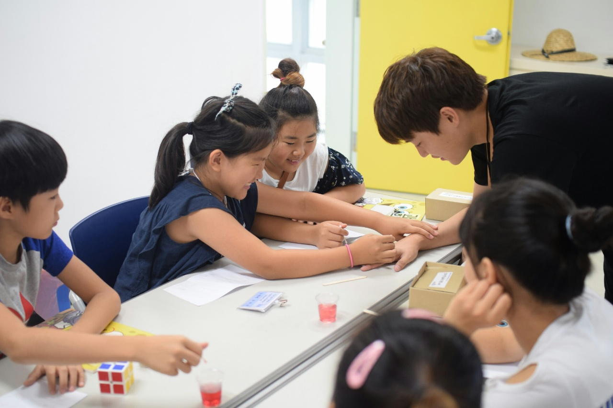

# Welcome to my Homepage
I am an undergraduate of Seoul National University majoring in Mathematical Sciences from 2016.
My double-major is Statistics.

## Education
**Seoul National University**
Bachelor of Science in Mathematical Sciences and Statistics
*   Expected Graduation Date: Jul 2022

**Seoul Science High School**
*   Graduation Date: Feb 2016

### Academic Gap (2019 - 2020)

I served in the Republic of Korea Army (Apr 2020 - Nov 2021). I took many online courses and read various books and materials.

During the military service, I found out that I have to take other courses in Spring 2021 required for graduation. (Earth Science Lab, etc.)
So, I tried to build an academic background in statistics.

**Preview**
> Finished Ch5. Markov chain of “Probability: Theory and Examples” - R. Durrett
> “Mathematical Statistics: Basic Ideas and Selected Topics” _by P.J. Bickel and K.A. Doksum_
> Real analysis of “Real and Complex Analysis” _by W. Rudin_
> “Introduction to Linear Regression Analysis” _by D. Montgomery, E. A. Peck, and G. Vining_
> Seoul National University “Time series analysis” lecture notes _by S. Cho_

**Review**
> “Mathematical Statistics” _by W. Kim_
> “Principles of Mathematical Analysis” _by W. Rudin_

### Coursera courses
1. __“Deep Learning”__ Specialization (In progress, 4/5)	_offered by “Deeplearning.ai”_
*   Learned basic structure of neural networks and contemporary methods of compare and improve models
[Link](https://www.coursera.org/specializations/deep-learning)
[Certificate](./Coursera_Neural.pdf)

2. __“Practical Time Series Analysis”__ course _offered by “The State University of New York”_
*   Understood theories of traditional time series model (ARMA, ARIMA, SARIMA) with R data in economics and environmental sciences
[Link](https://www.coursera.org/learn/practical-time-series-analysis)
[Certificate](./Coursera_PTSA.pdf)

3. __“Machine Learning”__ course (Audit) _offered by “Stanford University”_
*  Studied the theories of supervised and unsupervised learning and techniques dealing with overfitting
[Link](https://www.coursera.org/learn/machine-learning)

4. __“Improve Your English Communication Skills”__ Specialization (Audit) _offered by “Georgia Institute of Technology”_
*   Learned how to write professional emails in English and practiced pronunciation and intonation
[Link](https://www.coursera.org/specializations/improve-english)
[books_and_courses list](./Books.html)

## Research
### Research 1 (Delivery, Jun 2021 - Nov 2021) 
*   Title: “Dynamic Pickup and Delivery Problem: Dynamic Bundling, Postponement Heuristics, Spatial Clustering based Bundling, and Assignment Heuristics” _with H. Park_

[Abstract](./Research/1.md)
[Full_presentation(Eng)](./Research/Dynamic_Pickup_and_Delivery_Problem(Eng).pdf) 
[Full_presentation(Kor)](./Research/Dynamic_Pickup_and_Delivery_Problem(Kor).pdf)	

### Research 2 (Feller Processes, Jun 2021 - Aug 2021)
*   Title: “Feller Processes and Their Applications”

[Abstract](./Research/2.md)
[Full_report(Eng)](./Research/Feller.pdf)

### Research 3 (Unit Root Tests for Panel Data, Jun 2021 - Aug 2021)
*   Title: “Unit root tests for Panel Data and Application to World Temperature Data”

[Abstract](./Research/3.md)
[Full_report(Kor)](./Research/Panel(Kor).pdf)

### Research 4 (Extreme Value Theory, Sep 2018 - Feb 2019)
*   Title: “Understanding Extreme Value Theory and Application to Fine Dust Level in South Korea”

[Abstract](./Research/4.md)
[Full_report(Eng)](./Research/EVT(Eng).pdf)

## Selected Assignments and Reports
*Note: For the collection of **homeworks**, later chapter comes first, so you may find **advanced contents at the upper part**.

### 2021-2 (Fall 2021)
#### "Data Mining and Lab." (2021-2)
**Report:** We developed models predicting the effect of COVID-19 vaccine on potential occurrence of life-threatening illnesses. We used logistic regression, linear discriminant analysis, and KNN methods to obtain the models. The research is still in progress, so only the interim report can be offered.

[Interim_report(Eng)](./DataMining/interim_report.pdf)

The homeworks include 
*   comparing accuracies of classifiers made by ridge regression, LASSO, PCR, PLS models;
*   fitting logistic regression and obtaining the variance of bootstrap distribution;
*   generating data and applying linear regression.

[Homeworks(Eng)](./DataMining/data_mining.pdf)

### 2021-1 (Spring 2021)
#### "Applied Statistics" (2021-1)
Note that I include hand-written homeworks, which is tidy and written in English. The homeworks include
*   properties of Generalized Linear Models
*   applying EM algorithm to the Poisson mixture model and to the missing covariates in simple linear regression model
*   computing influence function and proving the robustness of a statistic
*   finding the best predictor in a mixed effect model
*   obtaining a multidimensional confidence region in multiple linear regression
*   comparing models and select parameters using Adjusted R-squared, Mallow's Cp, and LOOCV.

[Homeworks(Eng)](./Apps.pdf)

#### "Nonparametric Statistics and Lab." (2021-1)
The homeworks include
*   deriving several confidence intervals of linear regression coefficients using bootstrap
*   applying several bootstrap methods includng jackknife resampling to obtain the confidence interval for a parameter
*   obtaining significant variables by applying permutation tests 
[Homeworks(Eng)](./Nonpar.pdf)

#### "Real Analysis" (2021-1)
The file contains hand-written homeworks submitted for the "Real analysis" course. Especially, **"HW5"** starts from **page 15** was selected as a "model answer".
The homeworks include

[Homeworks(Eng)](./real_analysis.pdf)

### 2017-2 (Fall 2017)
#### "Statistical Computing and Lab." (2017-2)
**Report:** I explained rejection sampling methods and developed a function that performs three rejection sampling methods using the derivative of log-density function.
[Report(Kor)](./jt.pdf)

## Extracurricular Activities
I worked as the student president of the Department of Mathematical Sciences representing about 200 undergraduates. Also, I participated in many volunteering activities.
For more detailed explanations and pictures, please click here. (including Mr. FAN)
[Click](./gb.html)

